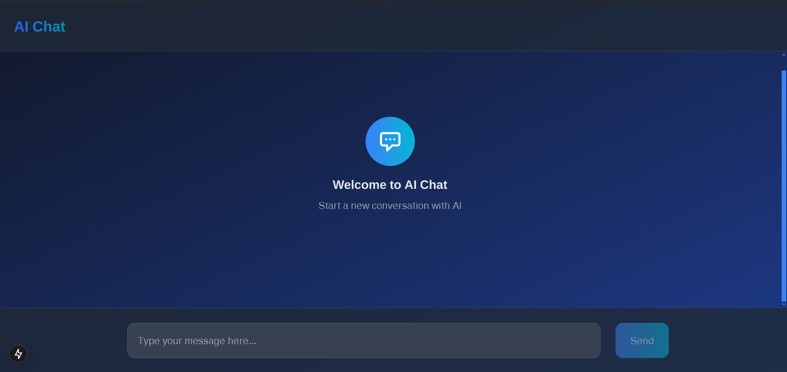

# AI App

A modern Next.js application with AI capabilities.

## Getting Started

First, run the development server:

```bash
npm run dev
# or
yarn dev
# or
pnpm dev
# or
bun dev
```

Open [http://localhost:3000](http://localhost:3000) with your browser to see the result.

You can start editing the page by modifying `app/page.tsx`. The page auto-updates as you edit the file.

This project uses [`next/font`](https://nextjs.org/docs/app/building-your-application/optimizing/fonts) to automatically optimize and load [Geist](https://vercel.com/font), a new font family for Vercel.

## Features

- Modern UI with Tailwind CSS
- TypeScript support
- Responsive design

## Prerequisites

- Node.js 18.17 or later
- npm or yarn package manager

## Installation

1. Clone the repository:
```bash
git clone [your-repository-url]
cd ai-app
```

2. Install dependencies:
```bash
npm install
# or
yarn install
```

## Environment Setup

Before running the application, you need to set up your environment variables:

1. Create a `.env.local` file in the root directory of the project
2. Add your Google Gemini Pro API key to the file:
   ```env
   NEXT_PUBLIC_GOOGLE_API_KEY=your_api_key_here
   ```

To get your API key:
1. Go to [Google AI Studio](https://makersuite.google.com/app/apikey)
2. Create or sign in to your Google account
3. Create a new API key
4. Copy the API key and paste it in your `.env.local` file

⚠️ **Important**: 
- Never commit your `.env.local` file to version control
- Keep your API key private and secure
- If you need to deploy the application, make sure to set up the environment variables in your deployment platform

## Learn More

To learn more about Next.js, take a look at the following resources:

- [Next.js Documentation](https://nextjs.org/docs) - learn about Next.js features and API.
- [Learn Next.js](https://nextjs.org/learn) - an interactive Next.js tutorial.


## Contributing

Contributions are welcome! Please feel free to submit a Pull Request.
